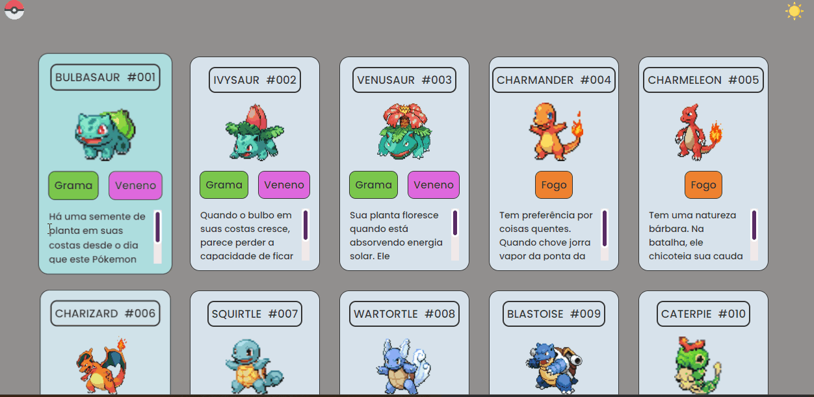

## Cartas dos Pokémons!

As cartas se movimentam e transformam quando o cursor passa sobre a carta escolhida.

Utilizando a barra de rolagem dentro de cada carta você pode ver as informações sobre o personagem.

E clicando sobre o sol no alto à direita você troca o modo de exibição da página de claro  para escuro .

